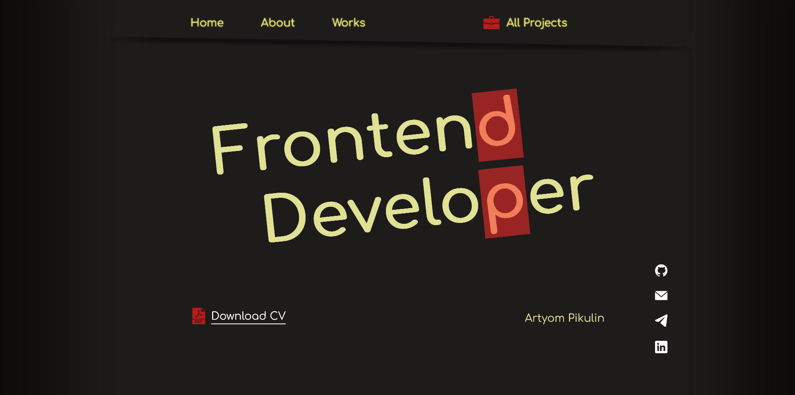

# My Portfolio

This is a website that functions as my portfolio.

## Project Functionality

This site contains information about me. You'll find there my bio as a frontend developer, technologies I'm familiar with, some of my works and a link to a website with all of them. You'll also find my social media links there, but they are also present on my GitHub page here.

You can visit the website eby clicking [this link](https://pikulinweb.ru)

## Technologies used:

- HTML
- CSS
- SCSS
- Flexbox
- Gsap
- AOS
- Gulp

## How to start

1. Clone the repository `git clone https://github.com/kanae367/my-portfolio`
2. Install all dependencies `npm install`
3. Run the `gulp` command
